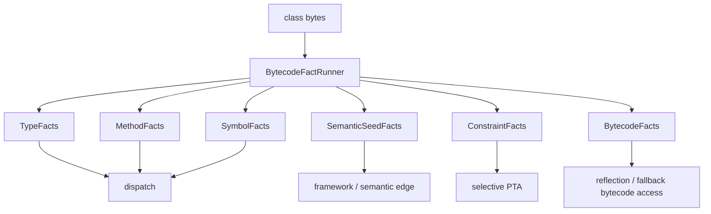

# 单次解析前端收口说明（JA-NT-106）

本文档对应 [Phase 0 实施文档](/Users/veritas/Documents/projects/jar-analyzer/doc/README-no-taie-phase0.md) 中的 `JA-NT-106`，用于记录这次单次解析前端收口的目标、实现结果和关闭边界：

- 当前重复解析到底发生在哪些地方
- `BytecodeFactRunner` 的目标输出模型是什么
- 单次解析与按需 frame 分析如何切分
- 旧 runner 哪些会被吸收、哪些会保留为薄适配层
- 新 facts 如何供给 `dispatch / reflection / selective PTA`

本文档直接建立在 [README-no-taie-fact-snapshot.md](/Users/veritas/Documents/projects/jar-analyzer/doc/README-no-taie-fact-snapshot.md) 的 `BuildFactSnapshot` 设计之上，也受 [README-no-taie-pta-subset.md](/Users/veritas/Documents/projects/jar-analyzer/doc/README-no-taie-pta-subset.md) 的 PTA 约束面约束。

## 1. 结论

结论先行：

- 当前主干已经有一条统一的单次解析前端：`BuildBytecodeWorkspace + BytecodeFactRunner + BuildFactSnapshot + BuildEdgeAccumulator`。
- [DiscoveryRunner.java](/Users/veritas/Documents/projects/jar-analyzer/src/main/java/me/n1ar4/jar/analyzer/core/DiscoveryRunner.java)、[ClassAnalysisRunner.java](/Users/veritas/Documents/projects/jar-analyzer/src/main/java/me/n1ar4/jar/analyzer/core/ClassAnalysisRunner.java)、[BytecodeSymbolRunner.java](/Users/veritas/Documents/projects/jar-analyzer/src/main/java/me/n1ar4/jar/analyzer/core/BytecodeSymbolRunner.java) 已经接到这条主链上，不再各自拥有一份独立前端。
- `DispatchCallResolver.collectInstantiatedClasses`、[BytecodeMainlineReflectionResolver.java](/Users/veritas/Documents/projects/jar-analyzer/src/main/java/me/n1ar4/jar/analyzer/core/BytecodeMainlineReflectionResolver.java)、[SelectivePtaRefiner.java](/Users/veritas/Documents/projects/jar-analyzer/src/main/java/me/n1ar4/jar/analyzer/core/pta/SelectivePtaRefiner.java) 在 bytecode-mainline 主路径下已经优先消费共享 workspace，而不是再各自重扫 class bytes。
- `BytecodeFactRunner` 当前负责把前端 facts 收口到 `BuildFactSnapshot`，边继续由后续 `dispatch / reflection / semantic / PTA` builder 写入 `BuildEdgeAccumulator`。
- `ConstraintFacts` 还没有唯一 owner，这部分留到 Phase 1 继续收口，但不再阻塞 `JA-NT-106` 关闭。

一句话总结：

- `BytecodeFactRunner` 是“单次解析事实主链”
- `dispatch / reflection / selective PTA` 是“消费 facts 的边构建器”
- `CoreRunner` 只负责编排，不再让每个 builder 自己重读一遍字节码

### 1.1 当前代码落点（2026-03-11）

当前主链的关键落点如下：

- `src/main/java/me/n1ar4/jar/analyzer/core/bytecode/BuildBytecodeWorkspace.java`
- `src/main/java/me/n1ar4/jar/analyzer/core/facts/BuildFactSnapshot.java`
- `src/main/java/me/n1ar4/jar/analyzer/core/facts/BuildFactAssembler.java`
- `src/main/java/me/n1ar4/jar/analyzer/core/facts/BytecodeFactRunner.java`
- `src/main/java/me/n1ar4/jar/analyzer/core/edge/BuildEdgeAccumulator.java`
- `src/main/java/me/n1ar4/jar/analyzer/core/CoreRunner.java`

当前已经实现的主链行为：

- `CoreRunner` 先统一解析出 `BuildBytecodeWorkspace`
- discovery、class-analysis、bytecode-symbol 共用这份 workspace
- `ParsedMethod.sourceFrames()` 提供共享 frame cache
- bytecode-mainline 的 dispatch/reflection/selective PTA 都优先吃 `snapshot.bytecode().workspace()`

## 2. 当前重复解析现状

当前默认 build 里，同一份 class bytes 至少可能被以下组件重复读取：

| 位置 | 当前职责 | 解析形态 | 重复问题 |
| --- | --- | --- | --- |
| [DiscoveryRunner.java](/Users/veritas/Documents/projects/jar-analyzer/src/main/java/me/n1ar4/jar/analyzer/core/DiscoveryRunner.java) | 类/方法发现、注解字符串 | `ClassReader + DiscoveryClassVisitor` | 第一次完整扫描 |
| [ClassAnalysisRunner.java](/Users/veritas/Documents/projects/jar-analyzer/src/main/java/me/n1ar4/jar/analyzer/core/ClassAnalysisRunner.java) | 字符串、Spring、JavaWeb | `ClassReader + visitor chain` | 第二次完整扫描 |
| [BytecodeSymbolRunner.java](/Users/veritas/Documents/projects/jar-analyzer/src/main/java/me/n1ar4/jar/analyzer/core/BytecodeSymbolRunner.java) | callsite、localvar、receiverType | `ClassReader + ClassNode + per-method frame` | 第三次完整扫描 |
| [DispatchCallResolver.java](/Users/veritas/Documents/projects/jar-analyzer/src/main/java/me/n1ar4/jar/analyzer/core/DispatchCallResolver.java) | `NEW` 指令统计 | `ClassReader + ClassNode` | 第四次扫描，只为 `instantiatedClasses` |
| [BytecodeMainlineReflectionResolver.java](/Users/veritas/Documents/projects/jar-analyzer/src/main/java/me/n1ar4/jar/analyzer/core/BytecodeMainlineReflectionResolver.java) | 反射 / method handle / indy | `ClassReader + ClassNode + per-method frame` | 第五次扫描 |
| [SelectivePtaRefiner.java](/Users/veritas/Documents/projects/jar-analyzer/src/main/java/me/n1ar4/jar/analyzer/core/pta/SelectivePtaRefiner.java) | 局部 PTA 精化 | `ClassReader + ClassNode + per-method frame` | 第六次扫描 |

这还不包括：

- [FrameworkEntryDiscovery.java](/Users/veritas/Documents/projects/jar-analyzer/src/main/java/me/n1ar4/jar/analyzer/core/FrameworkEntryDiscovery.java) 对前置 facts 的消费
- [MethodSemanticSupport.java](/Users/veritas/Documents/projects/jar-analyzer/src/main/java/me/n1ar4/jar/analyzer/rules/MethodSemanticSupport.java) 对已发现方法和类事实的二次推导

真正的问题不是“扫描次数数字不好看”，而是：

1. 每条链都在重复建立自己的 `ClassNode` / `MethodNode` 视图。
2. 每条链都在自己决定什么时候跑 `Analyzer<SourceValue>`。
3. `dispatch / reflection / PTA` 需要的输入 facts 没有统一所有者，导致新增能力天然倾向于“自己再扫一次”。

## 3. `BytecodeFactRunner` 的角色定义

`BytecodeFactRunner` 不等于“又加一个 runner”。它的目标是取代“多个事实 runner 并行吃原始 bytes”的模式。

目标态应当是：

这里最关键的边界是：

- `BytecodeFactRunner` 负责“读 bytes，产 facts”
- 后续 builder 只读 facts，不再读 bytes
- 极少数必须读 `ClassNode/MethodNode` 的场景，通过 `BytecodeFacts` 统一访问，不允许每个 builder 各自建自己的字节码缓存

## 4. 目标输出模型

`BytecodeFactRunner` 的直接输出应是 `BuildFactSnapshot` 的以下子集：

### 4.1 `TypeFacts`

最低需要稳定产出：

- `classesByHandle`
- `inheritanceMap`
- `instantiatedClasses`
- `interfacesByClass`
- `superClassByClass`

这部分会吸收当前：

- `DiscoveryRunner` 的 `discoveredClasses / classMap`
- `DispatchCallResolver.collectInstantiatedClasses`

### 4.2 `MethodFacts`

最低需要稳定产出：

- `methodsByHandle`
- `methodsByClass`
- `access/name/desc/jarId`
- `line range` 的最小索引

这部分会吸收当前：

- `DiscoveryRunner` 的 `discoveredMethods / methodMap`

### 4.3 `SymbolFacts`

最低需要稳定产出：

- `callSites`
- `callSitesByCaller`
- `callSitesByKey`
- `localVarsByMethod`
- `receiverTypeByCallSiteKey`
- `stringLiteralsByMethod`
- `annotationStringsByMethod`

这部分会吸收当前：

- `BytecodeSymbolRunner` 的 `callSites`
- `BytecodeSymbolRunner` 的 `receiverType`
- `BytecodeSymbolRunner` 的 `LocalVarEntity`
- `ClassAnalysisRunner` / `DiscoveryRunner` 分散产出的字符串事实

### 4.4 `SemanticSeedFacts`

这不是最终 `MethodSemanticFlags`，而是为语义层准备的稳定输入：

- `springControllerSeeds`
- `javaWebSeeds`
- `frameworkAnnotationSeeds`
- `resourceReferenceHints`
- `entrypointSeeds`

这部分的意义是让 `ClassAnalysisRunner` 当前那些 visitor 能迁成“事实提取”，而不是直接往 `BuildContext.controllers/servlets/...` 写最终结果。

### 4.5 `ConstraintFacts`

这是 `JA-NT-106` 真正必须交付清楚的部分。它最终必须覆盖 [README-no-taie-pta-subset.md](/Users/veritas/Documents/projects/jar-analyzer/doc/README-no-taie-pta-subset.md) 对 `JA-NT-106` 的约束：

- `receiverVarByCallSiteKey`
- `allocEdges`
- `assignEdges`
- `fieldStoreEdges`
- `fieldLoadEdges`
- `arrayStoreEdges`
- `arrayLoadEdges`
- `arrayCopyEdges`
- `nativeModelHints`

额外建议补上：

- `returnEdges`
- `exceptionFlowHints`
- `constStringHints`
- `methodHandleHints`

否则后续 `reflection / PTA` 迟早还会回到“自己再扫 MethodNode”的旧路。

### 4.6 `BytecodeFacts`

这里的职责不是再存一份原始输入，而是统一访问：

- `ClassNodeView`
- `MethodNodeView`
- `FrameSummary`
- `lazy frame supplier`

要求：

- 默认允许后续 builder 只从这里取 `ClassNode/MethodNode`
- 禁止后续 builder 直接从 `ClassFileEntity.getFile()` 自己 new `ClassReader`

## 5. 单次解析与按需 frame 分析策略

`BytecodeFactRunner` 不能简单理解成“所有方法都先建 `ClassNode` 再全部跑 frame”。那样会把现在的重复解析问题变成一次性更重。

推荐策略是“两层切分”：

### 5.1 层一：每个 class 只做一次结构解析

统一流程：

1. `ClassReader` 读取 bytes
2. 构建单个 `ClassNode`
3. 在同一个 `ClassNode` 上完成：
   - 类/方法声明事实
   - 继承事实
   - 成员事实
   - 资源/框架 seed
   - `NEW` / `INVOKE*` / field / array / localvar / line number 原始事实

这一层不默认跑 `SourceInterpreter`。

### 5.2 层二：按方法、按特征触发 frame 分析

只对命中以下条件的方法跑 `Analyzer<SourceValue>`：

- 含 `INVOKEVIRTUAL/INVOKEINTERFACE` 且需要 receiver 细化
- 含反射入口：`Class.forName/loadClass/getMethod/invoke/findVirtual`
- 含 PTA 相关约束：`GETFIELD/PUTFIELD/AALOAD/AASTORE/System.arraycopy`
- 含 method-handle / lambda / concat / helper-flow

这意味着：

- 不是所有方法都需要 frame
- frame 结果应缓存在 `BytecodeFacts`，按 `methodHandle` 访问
- `TypedDispatchResolver`、`ReflectionResolver`、`SelectivePtaRefiner` 共享同一份 frame 结果

### 5.3 不允许的做法

`JA-NT-106` 之后，不允许继续出现：

- `BytecodeSymbolRunner` 先跑一遍 frame
- `ReflectionResolver` 再跑一遍 frame
- `SelectivePtaRefiner` 再跑一遍 frame

frame 分析必须有唯一 owner。

## 6. 对旧 runner 的吸收计划

### 6.1 `DiscoveryRunner`

应被完全吸收。

吸收后保留的只可能是一个薄适配层，例如：

- `DiscoveryRunner.start(...)` 变成 `BytecodeFactRunner` 的兼容包装

但长期目标是删除。

### 6.2 `ClassAnalysisRunner`

不建议保留现状。

它当前真正有价值的不是“runner”本身，而是内部 visitor：

- `StringClassVisitor`
- `SpringClassVisitor`
- `JavaWebClassVisitor`

这些 visitor 要迁成 `BytecodeFactRunner` 内部的分析阶段，或者迁成吃 `ClassNode` 的 `FactContributor`。

### 6.3 `BytecodeSymbolRunner`

应拆成两块后吸收：

- `callsite/localvar/line number` 原始事实提取
- `receiverType` / frame 相关推导

其中：

- 原始事实提取进入 `BytecodeFactRunner`
- frame 相关推导当前先由共享 workspace frame cache 承接；后续如果单独抽层，再收成统一的 `FrameFactAnalyzer`

### 6.4 `DispatchCallResolver.collectInstantiatedClasses`

当前 bytecode-mainline 主路径已经不再依赖 `DispatchCallResolver` 单独重扫 class bytes。

`instantiatedClasses` 现在由共享 workspace 统一收集，并通过 `BuildFactAssembler` 写入 `TypeFacts`。

### 6.5 `BytecodeMainlineReflectionResolver` 与 `SelectivePtaRefiner`

当前这两者已经从“自己扫描 class bytes”切到优先消费共享 workspace：

- 读 `BytecodeFacts`
- 读共享 frame cache / workspace method view

它们可以继续保留为独立 builder，但不再拥有自己的主路径输入前端。  
后续仍需继续把 PTA/反射约束进一步下沉到 `ConstraintFacts`。

## 7. 对 `dispatch / reflection / PTA` 的供给关系

### 7.1 `Dispatch`

最低输入：

- `TypeFacts.inheritanceMap`
- `TypeFacts.instantiatedClasses`
- `MethodFacts.methodsByHandle`
- `SymbolFacts.callSites`
- `SymbolFacts.receiverTypeByCallSiteKey`

意味着：

- `dispatch` 不需要自己读 `ClassNode`
- `typed-dispatch` 不需要再依赖 `CallSiteEntity.receiverType` 之外的额外扫描

### 7.2 `Reflection`

最低输入：

- `BytecodeFacts.methodNodes`
- `BytecodeFacts.framesByMethod`
- `ConstraintFacts.constStringHints`
- `MethodFacts.methodsByHandle`

意味着：

- `ReflectionResolver` 只做规则和路径恢复
- `static string` / `helper-flow` / `loadClass` 的事实不应散落在 resolver 内部自己建缓存

### 7.3 `Selective PTA`

最低输入：

- `ConstraintFacts.receiverVarByCallSiteKey`
- `allocEdges`
- `assignEdges`
- `fieldStore/loadEdges`
- `arrayStore/load/copyEdges`
- `nativeModelHints`
- `MethodFacts`
- `TypeFacts`

意味着：

- `SelectivePtaRefiner` 不再自己 `loadMethodUnits`
- `PointerAssignmentGraph` 风格的 facts 进入统一约束层

## 8. 当前实现形态

### 8.1 `BuildBytecodeWorkspace`

负责：

- 单次解析 `classFileList -> ClassNode`
- 按类、按方法暴露共享视图
- 统一缓存 `ParsedMethod.sourceFrames()`
- 统一收集 `instantiatedClasses`

### 8.2 `BytecodeFactRunner`

负责：

- 调用 `BuildFactAssembler`
- 把前端 facts 收口成 `BuildFactSnapshot`
- 交付 `BuildEdgeAccumulator` 给后续边构建器写入

### 8.3 `BuildFactSnapshot`

负责：

- 暴露给 `dispatch / reflection / semantic / PTA` 的只读事实接口
- 在 `BytecodeFacts` 中携带共享 workspace

### 8.4 `BuildEdgeAccumulator`

负责：

- 承接 `methodCalls / methodCallMeta`
- 继续保持当前 `MethodCallMeta` 契约，不改 Neo4j 与 runtime snapshot 的消费面

## 9. `JA-NT-106` 的完成结果

截至 2026 年 3 月 11 日，`JA-NT-106` 已满足关闭条件：

1. 重复解析矩阵已经写清楚。
2. `BytecodeFactRunner` 与 `BuildFactSnapshot` 的目标输出模型已经明确并落地。
3. 单次解析与按需 frame 分析已经收敛为 `BuildBytecodeWorkspace + ParsedMethod.sourceFrames()`。
4. `DiscoveryRunner / ClassAnalysisRunner / BytecodeSymbolRunner` 已经变成共享 workspace 的消费者。
5. `dispatch / reflection / PTA` 的主路径 facts 供给面已经统一到 `BytecodeFacts.workspace()`。

本次关闭时仍然保留的边界：

- `ConstraintFacts` 还是空骨架
- `SelectivePtaRefiner` 仍有内部约束提取逻辑，尚未完全变成纯 `ConstraintFacts` 消费者
- 兼容入口依然存在，但不再是主路径 owner

这意味着：

- `JA-NT-106` 已经完成
- Phase 1 的首要任务不是再做一轮前端收口，而是把 PTA/反射约束 owner 彻底下沉，并推进默认 profile 切换

## 10. 下一步边界

下一步应直接进入：

1. `ConstraintFacts` 唯一 owner 收口
2. `SelectivePtaRefiner` 去前端化
3. 默认调用图 profile 从 Tai-e 切到 bytecode 主链
4. Tai-e 退化为 `oracle-taie`

一句话收尾：

`JA-NT-106` 真正完成的标志，不是“多了一个 runner”，而是“单次解析前端已经拥有唯一 owner”。
