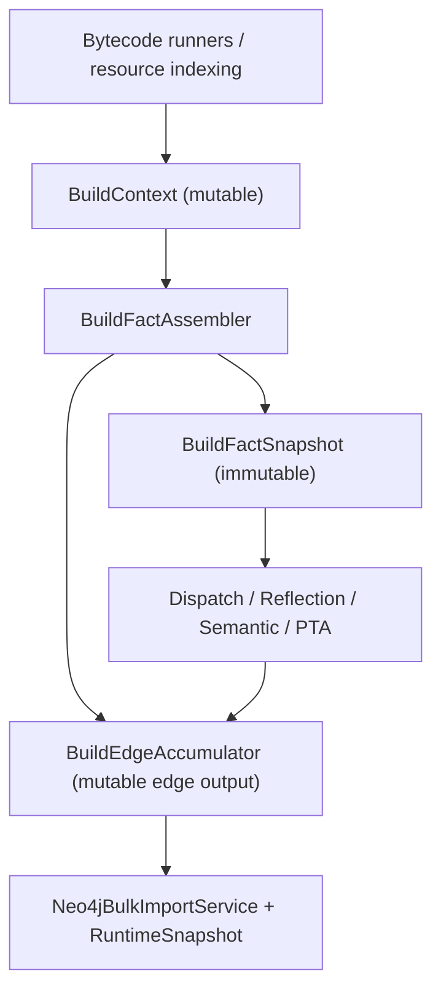

# `BuildFactSnapshot` 适配层设计（JA-NT-102）

本文档对应 [Phase 0 实施文档](/Users/veritas/Documents/projects/jar-analyzer/doc/README-no-taie-phase0.md) 中的 `JA-NT-102`，目标是定义：

- 当前主干怎样从 `BuildContext` 演进到统一 facts 模型
- `dev` 白名单内核该吃哪些 facts
- 哪些数据属于“输入事实”，哪些属于“边输出”

本文档的作用是给 `JA-NT-103 ~ JA-NT-106` 提供统一输入模型，避免后续每迁一个 resolver 就再发明一套上下文。

`JA-NT-106` 的单次解析与 facts 收敛路线见 [README-no-taie-bytecode-fact-runner.md](/Users/veritas/Documents/projects/jar-analyzer/doc/README-no-taie-bytecode-fact-runner.md)。

## 1. 结论

结论先行：

- 当前 [BuildContext.java](/Users/veritas/Documents/projects/jar-analyzer/src/main/java/me/n1ar4/jar/analyzer/core/build/BuildContext.java) 不能直接继续作为 `dispatch/reflection/PTA` 的长期输入模型。
- 需要新增一个不可变的 `BuildFactSnapshot`，专门承载“输入事实”。
- 需要把 `methodCalls / methodCallMeta` 从 `BuildContext` 的混合角色里拆出来，放入独立的 `BuildEdgeAccumulator`。
- 迁移期允许 `BuildContext -> BuildFactSnapshot` 适配，但不允许后续新 resolver 继续直接改 `BuildContext`。

一句话总结：

- `BuildContext` 是构建现场
- `BuildFactSnapshot` 是输入契约
- `BuildEdgeAccumulator` 是输出契约

### 1.1 当前实现状态（2026-03-11）

当前主干已经落地以下骨架：

- `src/main/java/me/n1ar4/jar/analyzer/core/facts/BuildFactSnapshot.java`
- `src/main/java/me/n1ar4/jar/analyzer/core/facts/BuildFactAssembler.java`
- `src/main/java/me/n1ar4/jar/analyzer/core/facts/BytecodeFactRunner.java`
- `src/main/java/me/n1ar4/jar/analyzer/core/edge/BuildEdgeAccumulator.java`

当前实现口径：

- `BuildFactAssembler.from(...)` 已成为 `BuildContext -> BuildFactSnapshot` 的主适配入口
- `BuildEdgeAccumulator` 已承接 `methodCalls / methodCallMeta`
- `BuildFactAssembler.legacyView(...)` 仍保留桥接，用于迁移期兼容现有消费者
- `BytecodeFacts` 当前不再只是“原始 class bytes 的访问入口”，而是显式携带单次解析后的 `BuildBytecodeWorkspace`
- `ConstraintFacts.receiverVarByCallSiteKey` 已经落地，当前由 `ConstraintFactAssembler` 基于共享 workspace 统一产出；method-level 的 `alloc/assign/field/array/native/return` 约束以及 reflection invoke / method-handle / class-new-instance hints 也已并入

## 2. 为什么当前 `BuildContext` 不够

当前 `BuildContext` 同时装了三类东西：

1. 输入事实
2. 过程缓存
3. 最终输出

具体表现：

- `classFileList / discoveredClasses / discoveredMethods / callSites` 属于输入事实
- `controllers / servlets / listeners / explicitSourceMethodFlags` 属于中间语义事实
- `methodCalls / methodCallMeta` 已经是输出边结果

这会导致后续迁移出现三个问题：

### 2.1 输入输出混在一起

`DispatchCallResolver` 和 `ReflectionCallResolver` 既要读 `BuildContext`，又要写回 `BuildContext.methodCalls`。  
这会让迁移期非常难做 side-by-side 对比，也不利于后续切换默认主链。

### 2.2 facts 不完整

当前 `BuildContext` 缺少：

- `inheritanceMap`
- `instantiatedClasses`
- PTA 约束 facts

这意味着 `dev` 内核一接进来，就会自然走向“自己再读一次字节码”。

### 2.3 容器粒度不稳定

当前 `BuildContext` 是为了方便 build 过程堆数据，不是为了给多个分析阶段提供稳定契约。  
它适合当前 `CoreRunner`，但不适合未来的：

- `DirectEdgeBuilder`
- `DispatchEdgeBuilder`
- `ReflectionEdgeBuilder`
- `SelectivePtaRefiner`

## 3. 目标态：facts 与 edges 分离

目标态建议拆成三层：



这里最关键的规则是：

- `BuildFactSnapshot` 只放输入事实
- `BuildEdgeAccumulator` 只放边与边元数据
- resolver 读 snapshot，写 accumulator

## 4. `BuildFactSnapshot` 的目标结构

建议未来增加 `core/facts/*`，核心入口类似：

```java
record BuildFactSnapshot(
    ArchiveFacts archives,
    TypeFacts types,
    MethodFacts methods,
    SymbolFacts symbols,
    ResourceFacts resources,
    SemanticFacts semantics,
    BytecodeFacts bytecode,
    ConstraintFacts constraints
) {}
```

下面是每一层的职责。

### 4.1 `ArchiveFacts`

职责：

- 输入归档
- `APP/LIBRARY/SDK` 归属
- `jarId -> origin`
- fat jar / nested lib / project-mode 的归档规范化结果

最低字段建议：

- `allArchives`
- `appArchives`
- `libraryArchives`
- `sdkArchives`
- `jarOriginsById`
- `primaryInput`
- `projectBuildMode`

这层主要服务：

- `dispatch/PTA` 的范围裁剪
- 后续 incremental cache key
- `precision` 的可选输入；当前不再依赖任何 Tai-e oracle

### 4.2 `TypeFacts`

职责：

- 类节点事实
- 类型继承事实
- 运行时实例化事实

最低字段建议：

- `classesByHandle`
- `methodsByClass`
- `inheritanceMap`
- `instantiatedClasses`

输入来源：

- 当前 `discoveredClasses`
- 当前 `discoveredMethods`
- 当前 `ClassReference.superClass/interfaces`
- 未来 `BytecodeFactRunner` 直接产出的 `NEW` 指令统计

这层主要服务：

- `DispatchCallResolver`
- `TypedDispatchResolver`
- `ContextSensitivePtaEngine`

### 4.3 `MethodFacts`

职责：

- 方法签名
- 访问标志
- 行号
- jar 归属

最低字段建议：

- `methodsByHandle`
- `methodsByClass`
- `entryMethods`

这里不应混入动态 source/sink 规则结果，但可以保存：

- `explicit entry flags`
- `stable method semantic flags`

### 4.4 `SymbolFacts`

职责：

- call sites
- local vars
- string literals / annotation strings

最低字段建议：

- `callSites`
- `callSitesByCaller`
- `callSitesByKey`
- `localVarsByMethod`
- `stringPoolByMethod`
- `annotationStringsByMethod`

特别说明：

- 当前 [CallSiteEntity.java](/Users/veritas/Documents/projects/jar-analyzer/src/main/java/me/n1ar4/jar/analyzer/entity/CallSiteEntity.java) 已经含有 `receiverType`，这是 `TypedDispatchResolver` 的直接输入。
- 当前 [LocalVarEntity.java](/Users/veritas/Documents/projects/jar-analyzer/src/main/java/me/n1ar4/jar/analyzer/entity/LocalVarEntity.java) 可以继续作为导航/展示事实，但 PTA 不应长期依赖它推导约束。

### 4.5 `ResourceFacts`

职责：

- XML / JSP / 资源文件事实
- `web.xml / struts*.xml / mapper.xml`

最低字段建议：

- `resources`
- `xmlFrameworkIndex`
- `jspCompileOutputs`

这层主要服务：

- `FrameworkEntryDiscovery`
- `MyBatis`/`Struts`/`JSP` 入口恢复
- 后续 framework semantic edge

### 4.6 `SemanticFacts`

职责：

- 当前 build 已经能稳定静态产出的语义位

最低字段建议：

- `methodSemanticFlags`
- `explicitSourceMethodFlags`
- `springControllers`
- `servlets`
- `filters`
- `listeners`

这一层只存静态 build 事实，不存动态规则结果。  
`ja.isSource / ja.isSink` 仍然留在规则系统动态判定。

### 4.7 `BytecodeFacts`

职责：

- 提供统一 class bytes / parsed node 访问
- 避免多个 resolver 自己各扫一遍

当前实现字段：

- `classFiles`
- `workspace`

其中 `workspace` 指向：

- `src/main/java/me/n1ar4/jar/analyzer/core/bytecode/BuildBytecodeWorkspace.java`

当前行为已经收敛为：

- `CoreRunner` 在前端阶段先统一解析出 `BuildBytecodeWorkspace`
- `DiscoveryRunner / ClassAnalysisRunner / BytecodeSymbolRunner / bytecode-mainline` 复用这份 workspace
- `ParsedMethod.sourceFrames()` 作为共享 frame cache，避免多个消费者各自重复 `Analyzer<SourceValue>`

### 4.8 `ConstraintFacts`

职责：

- PTA 需要的局部约束 facts

最低字段建议：

- `receiverVarByCallSiteKey`
- `assignEdges`
- `allocEdges`
- `fieldLoadEdges`
- `fieldStoreEdges`
- `arrayStoreEdges`
- `exceptionThrowEdges`
- `nativeModelHints`

这层仍然是后续 precision 收敛的唯一 owner。
截至 2026 年 3 月 11 日，当前代码里 `ConstraintFacts` 已经承接了 `receiverVarByCallSiteKey`、method-level 的 `alloc/assign/field/array/native/return` 约束，以及 reflection invoke / method-handle / class-new-instance hints；`SelectivePtaRefiner` 也已切到 `snapshot + BuildEdgeAccumulator` 输入，`BytecodeMainlineReflectionResolver` 已优先消费 `snapshot.constraints()`。默认主链切换、`oracle-taie` 收口以及适配层压缩都已经完成；Phase 6 也已完成，Tai-e 已从生产与测试路径一并移除，`CoreRunner` 和仓库测试都只保留 bytecode-mainline。

## 5. `BuildEdgeAccumulator` 的目标结构

`BuildFactSnapshot` 不应该再承载边输出。建议单独增加：

```java
final class BuildEdgeAccumulator {
    Map<MethodReference.Handle, Set<MethodReference.Handle>> methodCalls;
    Map<MethodCallKey, MethodCallMeta> methodCallMeta;
}
```

设计要求：

- resolver 只往这里写边
- 每类边继续走当前 `MethodCallMeta` 类型体系：
  - `direct`
  - `dispatch`
  - `reflection`
  - `invoke_dynamic`
  - `method_handle`
  - `callback`
  - `framework`
  - `pta`
- `evidenceBits / confidence / opcode / reason` 必须继续完整保留

这意味着：

- [MethodCallMeta.java](/Users/veritas/Documents/projects/jar-analyzer/src/main/java/me/n1ar4/jar/analyzer/core/MethodCallMeta.java) 仍然可复用
- Neo4j 导入层和 `GraphSnapshot` 不需要因为底层引擎迁移而变更消费协议

当前实现已经落地到：

- `src/main/java/me/n1ar4/jar/analyzer/core/edge/BuildEdgeAccumulator.java`

## 6. 从当前 `BuildContext` 到 `BuildFactSnapshot` 的适配

迁移期不需要一上来重写所有 runner，先做一个 assembler 即可：

```java
BuildFactSnapshot snapshot = BuildFactAssembler.from(
    context,
    scopeSummary,
    jarOriginsById,
    localVars,
    workspace
);
BuildEdgeAccumulator edges = BuildEdgeAccumulator.empty();
```

### 6.1 当前字段的归属迁移

| 当前 `BuildContext` 字段 | 新归属 |
| --- | --- |
| `classFileList` | `BytecodeFacts` |
| `discoveredClasses` | `TypeFacts` |
| `discoveredMethods` | `MethodFacts` |
| `classMap` | `TypeFacts` |
| `methodMap` | `MethodFacts` |
| `strMap` / `stringAnnoMap` | `SymbolFacts` |
| `resources` | `ResourceFacts` |
| `callSites` | `SymbolFacts` |
| `controllers / servlets / filters / listeners` | `SemanticFacts` |
| `explicitSourceMethodFlags` | `SemanticFacts` |
| `methodCalls` / `methodCallMeta` | `BuildEdgeAccumulator` |

### 6.2 当前还要补的 facts

迁移 `BuildFactSnapshot` 时，还需要补两个 assembler 步骤：

1. `TypeHierarchyAssembler`
   - 从 `discoveredClasses` 生成 `inheritanceMap`
2. `InstantiationFactAssembler`
   - 从统一字节码扫描结果生成 `instantiatedClasses`

这两步是 `JA-NT-103` 的前置条件。

## 7. 白名单内核各自需要的最小 facts

### 7.1 `DispatchCallResolver`

最小输入：

- `TypeFacts.inheritanceMap`
- `TypeFacts.instantiatedClasses`
- `MethodFacts.methodsByHandle`
- `TypeFacts.classesByHandle`
- `BuildEdgeAccumulator.methodCalls`

它不需要：

- JSP/XML/resources
- local vars
- 规则系统

### 7.2 `TypedDispatchResolver`

最小输入：

- `SymbolFacts.callSites`
- `MethodFacts.methodsByHandle`
- `TypeFacts.classesByHandle`
- `TypeFacts.inheritanceMap`
- `BuildEdgeAccumulator.methodCalls`

它不需要读 class bytes。

### 7.3 `ReflectionCallResolver`

最小输入：

- `BytecodeFacts`
- `MethodFacts.methodsByHandle`
- `BuildEdgeAccumulator.methodCalls`
- `BuildEdgeAccumulator.methodCallMeta`

如果后续把 reflection const propagation 也收进 `ConstraintFacts`，可进一步缩小它的 ASM 直接访问面。

### 7.4 `EdgeInference` 规则库

最小输入：

- `SemanticFacts`
- `TypeFacts`
- `MethodFacts`
- `BuildEdgeAccumulator`

它不应再自己扫描 bytecode。

### 7.5 `ContextSensitivePtaEngine`

最小输入：

- `TypeFacts`
- `MethodFacts`
- `SymbolFacts.callSites`
- `ConstraintFacts`
- `BuildEdgeAccumulator` 的当前 provisional edges

它不应再直接去碰：

- XML/JSP/resource indexing
- GUI/runtime 状态
- Neo4j/DatabaseManager

## 8. 推荐包结构

建议新增：

- `src/main/java/me/n1ar4/jar/analyzer/core/facts/BuildFactSnapshot.java`
- `src/main/java/me/n1ar4/jar/analyzer/core/facts/BuildFactAssembler.java`
- `src/main/java/me/n1ar4/jar/analyzer/core/facts/ArchiveFacts.java`
- `src/main/java/me/n1ar4/jar/analyzer/core/facts/TypeFacts.java`
- `src/main/java/me/n1ar4/jar/analyzer/core/facts/MethodFacts.java`
- `src/main/java/me/n1ar4/jar/analyzer/core/facts/SymbolFacts.java`
- `src/main/java/me/n1ar4/jar/analyzer/core/facts/ResourceFacts.java`
- `src/main/java/me/n1ar4/jar/analyzer/core/facts/SemanticFacts.java`
- `src/main/java/me/n1ar4/jar/analyzer/core/facts/BytecodeFacts.java`
- `src/main/java/me/n1ar4/jar/analyzer/core/facts/ConstraintFacts.java`
- `src/main/java/me/n1ar4/jar/analyzer/core/edge/BuildEdgeAccumulator.java`

注意：

- 这不是鼓励拆很多薄类，而是把稳定契约单独收出来
- 真正的装配逻辑应集中在 `BuildFactAssembler`

## 9. 收口后的主链接线方式

当前主链接线方式：

1. 当前 `CoreRunner` 继续跑既有 stages
2. 在 `method semantic` 和 `bytecode symbol` 之后，新增：
   - `BuildFactSnapshot snapshot = BuildFactAssembler.from(...)`
3. 后续 resolver/PTA 统一只允许写 `BuildEdgeAccumulator`
4. 新增 `dispatch/reflection` 时，也只允许写 `BuildEdgeAccumulator`
5. `Neo4jBulkImportService` 和 `ProjectRuntimeSnapshot` 消费：
   - `snapshot`
   - `edgeAccumulator`

这样可以做到：

- 主链 owner 单一
- 契约稳定
- 新能力只在 facts/edges 层扩展，不再引入第二条调用图入口

## 10. `JA-NT-102` 的完成定义

`JA-NT-102` 完成后，项目内对迁移输入模型的口径应统一为：

- `BuildContext` 只是当前 build 现场容器
- 新 resolver/PTA 不再直接把 `BuildContext` 当长期契约
- 输入统一收敛为 `BuildFactSnapshot`
- 边统一收敛为 `BuildEdgeAccumulator`

如果后续设计里又出现：

- 每个 resolver 都直接吃 `BuildContext`
- 每个 resolver 都自己重扫 class bytes
- 输入事实和输出边继续混在同一个容器里

则说明该 issue 没有真正落地。
