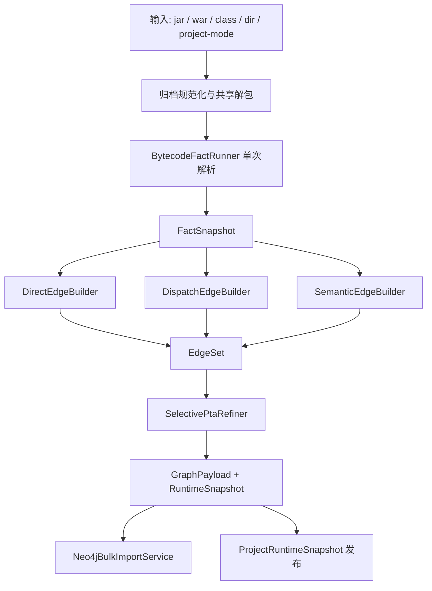

# 去 Tai-e 主链化设计（JDK 21）

本文档记录 `jar-analyzer` 从“Tai-e 作为默认建库主链”迁移到“字节码自研主链 + 选择性精化”的完整设计与最终收口结果。

配套执行文档见 [README-no-taie-phase0.md](/Users/veritas/Documents/projects/jar-analyzer/doc/README-no-taie-phase0.md)。

`dev` 分支可迁移分析内核白名单见 [README-no-taie-dev-kernel-inventory.md](/Users/veritas/Documents/projects/jar-analyzer/doc/README-no-taie-dev-kernel-inventory.md)。

`BuildContext -> BuildFactSnapshot` 适配层设计见 [README-no-taie-fact-snapshot.md](/Users/veritas/Documents/projects/jar-analyzer/doc/README-no-taie-fact-snapshot.md)。

`ContextSensitivePtaEngine` 最小可迁子集设计见 [README-no-taie-pta-subset.md](/Users/veritas/Documents/projects/jar-analyzer/doc/README-no-taie-pta-subset.md)。

单次解析前端收口说明见 [README-no-taie-bytecode-fact-runner.md](/Users/veritas/Documents/projects/jar-analyzer/doc/README-no-taie-bytecode-fact-runner.md)。

结论先行：

- 不建议继续让 Tai-e 作为默认建库主干。
- 不建议 fork/裁剪 Tai-e 后自行维护其核心前端、World、IR、PTA 体系。
- 建议采用 `dev` 分支已有的 ASM/字节码自研能力作为迁移种子，重建一条面向当前 Neo4j 项目模型的单主链建库体系。
- Tai-e 已从仓库构建与运行路径中彻底移除；当前只保留历史基线与迁移文档。

## 0. 当前状态（2026-03-11）

截至 2026 年 3 月 11 日，Phase 0 已完成，当前主干状态如下：

- 默认 build 已切到 `balanced` 字节码主链；`taie` 与 `oracle-taie` 已从生产配置面移除
- `fast / balanced / precision` 的 profile 契约已经落地，见 `doc/README-no-taie-profile-switch.md`
- 单次解析前端收口已经进入主建库链：`BuildBytecodeWorkspace + BuildFactSnapshot + BuildEdgeAccumulator + BytecodeFactRunner`
- bytecode-mainline 已经能在 callback、framework-stack 等真实样本上跑通主链并进入回归包
- 默认主链切换与历史 oracle 收口已经完成；`ConstraintFacts / selective PTA / precision` 的 Phase 4 收口也已经完成
- Phase 5 的历史 oracle 适配层压缩已经完成；Phase 6 也已完成，Tai-e 已从生产与测试路径一并移除

## 1. 背景与问题定义

当前分支的建库主链大体分为两段：

1. 先做字节码事实发现：`DiscoveryRunner`、`ClassAnalysisRunner`、`FrameworkEntryDiscovery`、`MethodSemanticSupport`、`BytecodeSymbolRunner`
2. 历史上再进入 Tai-e 调用图阶段：`TaieAnalysisRunner` + `TaieEdgeMapper`

对应代码入口在：

- `src/main/java/me/n1ar4/jar/analyzer/core/CoreRunner.java`
- 当前仓库已不再保留 `core/taie/*`

现状的核心问题不是“Tai-e 不准”，而是“Tai-e 被放在了错误的位置上”。

### 1.1 当前主链的结构性问题

当前 `CoreRunner` 会先完成 discovery/class-analysis/framework-entry/method-semantic/bytecode-symbol，再进入统一的调用图阶段。进入调用图阶段前会直接清空 `context.methodCalls` 和 `context.methodCallMeta`，然后由选中的调用图引擎回填；截至 2026 年 3 月 11 日，未显式配置时默认引擎已切到 `balanced` 字节码主链。

这意味着：

- 前置阶段已经做过一次重解析和事实提取
- Tai-e 又会重新准备输入、重建 classpath、重建 World、跑 PTA、再映射回本项目的数据模型
- 最终默认调用图来源仍是外部整包分析框架，而不是我们自己已经掌握的字节码事实

结果是建库“前面做一遍，后面再做一遍”，而且第二遍还是黑盒程度更高、调优成本更大的整包运行。

### 1.2 Tai-e 不是适合长期内嵌为默认主链的前端

Tai-e 本体当前仍然依赖 Soot frontend：

- `Tai-e/build.gradle.kts` 明确引入 `lib/sootclasses-modified.jar` 和 `org.soot-oss:soot`
- `Tai-e/docs/en/command-line-options.adoc` 也明确说明当前前端仍基于 Soot
- `pascal.taie.frontend.soot.SootWorldBuilder` 负责用 Soot 构建 World

也就是说，Tai-e 不是一个“拿来只做一点调用图”的轻量库，而是一整套：

- World / Options / Config / Plan
- ClassHierarchy / TypeSystem
- Soot frontend
- IRBuilder
- PointerAnalysis / CallGraph / Plugin

如果尝试“只剥离其中有用的部分”，实际会立刻落入维护以下复杂面的陷阱：

- Soot 前端与 Tai-e World 的耦合
- JMethod / Type / IR / NativeModel 的对象体系
- PTA solver 与 plugin 生命周期
- 输入选项、main class、implicit entries、reflection log、invokedynamic 回退等运行时约束

这不是一个低成本裁剪动作，而是一次高风险框架接管。

### 1.3 `dev` 分支已经给出了更适合我们的方向

`dev` 分支并不是“没有调用图，只做字符串扫描”。它已经有一套更接近我们长期方向的自研能力：

- `DispatchCallResolver`
- `TypedDispatchResolver`
- `ReflectionCallResolver`
- `EdgeInferencePipeline`
- `ContextSensitivePtaEngine`

`dev` 的问题不在分析内核，而在当时的持久化和系统形态已经过时，不适合直接整支回滚。

因此正确方向不是回退到 `dev`，而是：

- 保留当前分支的 Neo4j 项目模型、GUI/API/MCP、规则热刷新、Flow/Gadget 能力
- 把 `dev` 的字节码分析内核迁入当前主链
- 让 Tai-e 从默认主链退出

## 2. 设计目标

### 2.1 目标

新主链必须同时满足以下目标：

- 建库默认路径完全基于字节码自研能力，不依赖 Tai-e
- 保持单进程、单活项目、Neo4j Embedded、JDK 21、仅字节码输入这几个总约束不变
- 对外图契约保持稳定：`JANode/Method/Class`、`CALLS_*`、`ALIAS/HAS/EXTEND/INTERFACES`、`call_site_key/line_number/call_index/source_flags/confidence/evidence/edge_semantic_flags`
- 保持 `ProjectRuntimeSnapshot`、Cypher、DFS、Taint、Gadget、规则热刷新 的消费面不破
- 建库时间和峰值内存明显下降
- 精度上至少覆盖当前已落地的 Web/JSP/XML/Gadget 回归，不允许为了提速而回退这些能力

### 2.2 非目标

以下内容不属于本次设计目标：

- 不引入源码索引链路
- 不引入第二套图存储
- 不长期维持 “Tai-e 主链 + 自研主链” 双轨并行
- 不把 `dev` 的旧 SQLite/旧投影架构原样搬回当前分支

## 3. 当前系统必须保留的契约

去 Tai-e 主链化不是只改 `CoreRunner`，必须满足当前系统其他模块的既有契约。

### 3.1 建库输出契约

当前建库最终要同时产出两份事实：

1. Neo4j 项目库
2. `ProjectRuntimeSnapshot`

依赖代码：

- `src/main/java/me/n1ar4/jar/analyzer/storage/neo4j/Neo4jBulkImportService.java`
- `src/main/java/me/n1ar4/jar/analyzer/core/ProjectRuntimeSnapshot.java`

因此新主链必须继续产出至少这些事实：

- class/method 节点
- `methodCalls + methodCallMeta`
- call sites
- local vars
- resources
- strings / annotation strings
- spring/web/framework 入口事实
- method semantic flags

### 3.2 图消费契约

当前图快照加载和 Flow/Query/Gadget 全都依赖图边上的元数据：

- `rel_type`
- `confidence`
- `evidence`
- `alias_kind`
- `op_code`
- `call_site_key`
- `line_number`
- `call_index`
- `edge_semantic_flags`

依赖代码：

- `src/main/java/me/n1ar4/jar/analyzer/storage/neo4j/Neo4jGraphSnapshotLoader.java`
- `src/main/java/me/n1ar4/jar/analyzer/graph/store/GraphEdge.java`
- `src/main/java/me/n1ar4/jar/analyzer/graph/flow/*`

因此新主链不能只求“边数差不多”，而必须保证边元数据仍然完整。

### 3.3 规则和热刷新契约

安全语义不允许固化成只能重建后生效的静态标签。`ja.isSource/ja.isSink/ja.sinkKind` 仍然必须保持动态判断。

因此新主链可以静态入图：

- structure facts
- call edges
- method/edge semantic flags

但不能把动态规则判定替换成静态硬编码标签。

## 4. 方案选型结论

| 方案 | 速度 | 可控性 | 维护成本 | 精度上限 | 结论 |
| --- | --- | --- | --- | --- | --- |
| 继续以 Tai-e 为默认主链 | 差 | 低 | 高 | 高 | 不推荐 |
| fork/裁剪 Tai-e 后自养 | 中 | 中 | 极高 | 高 | 不推荐 |
| 字节码自研主链 + 选择性精化 | 好 | 高 | 中 | 高 | 推荐 |

推荐方案的关键不是“完全放弃精度”，而是把精度投入放在更合适的位置：

- 默认 build：走快速、可控、可调的字节码主链
- 难点调用点：按需做精化
- 对照验证：依赖冻结基线与回归包，不再依赖仓库内 Tai-e

## 5. 目标态架构

### 5.1 总体原则

- 单主链：默认只保留一条建库主链
- 单次解析：同一 class bytes 默认只做一次完整 ASM 解析
- 分层精化：只有在必要的调用点上才进入高成本精化
- 事实先行：先构建稳定事实，再构建边，不让“整包分析器”直接定义最终图
- 图契约稳定：Neo4j、GraphSnapshot、Flow、Taint、Gadget 不感知底层引擎替换

### 5.2 目标模块分层

推荐新增或收敛为以下分层：

#### A. 归档与输入层

职责：

- 统一处理 jar/war/dir/project-mode 输入
- 统一处理 fat jar / nested lib / exploded war
- 统一处理 JSP 编译产物注入
- 统一生成 archive fingerprint，支撑缓存和后续增量

保留/吸收：

- 当前 `prepareProjectModelForBuild`
- 当前 `resolveBuildInputs`
- 当前 `prepareClassFiles`
- 当前 `JspCompileRunner`
- 当前 `ArchiveScopeClassifier`

需要改动：

- 删除 Tai-e 独占的二次 fat archive 预处理路径
- 所有后续阶段只消费统一解包产物，不允许再各自解一次包

#### B. 事实提取层

目标是用一个新的 `BytecodeFactRunner` 收敛当前三次以上的重复 ASM 遍历：

- `DiscoveryRunner`
- `ClassAnalysisRunner`
- `BytecodeSymbolRunner`
- 未来的 instantiated classes / inheritance seeds / invoke-dynamic facts

新的 `FactSnapshot` 至少包含：

- class facts
- method facts
- inheritance facts
- member facts
- annotations
- resources
- strings / annotation strings
- call sites
- local vars
- receiver type hints
- `new`/instantiated class facts
- invokedynamic / lambda / method-handle facts
- framework entry facts
- method semantic flags

其中：

- 结构事实和字符串事实使用一次 visitor 链即可得到
- callsite/localvar/receiver type 需要 method body 级分析时，仅对需要的方法做 frame 分析
- 反射、lambda、method-handle 所需的局部常量传播也放在这一层沉淀为 facts，而不是后面再重新读字节码

#### C. 边构建层

边构建从“整包调用图”改为“多阶段收敛”：

1. `DirectEdgeBuilder`
2. `DispatchEdgeBuilder`
3. `SemanticEdgeBuilder`
4. `SelectivePtaRefiner`

最终统一写入 `methodCalls + methodCallMeta`。

#### D. 入图与发布层

此层尽量不改外部契约，继续复用：

- `Neo4jBulkImportService`
- `ProjectRuntimeSnapshot`
- `ProjectRegistryService`
- `Neo4jGraphSnapshotLoader`

底层引擎替换不应改变 GUI/API/MCP/Flow 的使用方式。

## 6. 新主链的详细设计

### 6.1 Stage 0: 共享归档准备

目标：

- 只做一次 archive 规范化和解包
- 产物被 facts、边构建、Neo4j/runtime snapshot 共享

关键要求：

- `BOOT-INF/classes`、`WEB-INF/classes`、nested libs、exploded war 统一走同一套输出目录和索引
- JSP 编译结果在此阶段并入输入，而不是单独为某个下游引擎再处理
- 所有 `ClassFileEntity/ResourceEntity` 都绑定稳定的 `jarId/project origin/archive fingerprint`

### 6.2 Stage 1: `BytecodeFactRunner`

新增统一事实提取器，替代当前多 runner 重复解析。

建议输出模型：

- `BuildFactSnapshot`
  - `classFiles`
  - `resources`
  - `classMap`
  - `methodMap`
  - `inheritanceMap`
  - `callSites`
  - `localVars`
  - `methodStrings`
  - `methodAnnoStrings`
  - `controllers/interceptors/servlets/filters/listeners`
  - `explicitSourceMethodFlags`
  - `methodSemanticFlags`
  - `instantiatedClasses`
  - `invokeDynamicFacts`
  - `reflectionFacts`
  - `field/array/local assign facts`（供 PTA/reflection 使用）

实现建议：

- visitor 链保持 ASM 为唯一前端
- method body 若无虚调用、反射、indy、局部变量需求，则走轻量模式
- method body 若命中热点特征，再启用 frame 分析

目标是把当前：

- discovery
- string/spring/web analysis
- bytecode symbol

至少收敛成“单次类遍历 + 按需方法分析”。

### 6.3 Stage 2: `DirectEdgeBuilder`

职责：

- 从 `callSites` 直接产生 `STATIC/SPECIAL` 直连边
- 从 `InvokeDynamic` 中直接解析 lambda/metafactory 可确定目标
- 记录 `TYPE_DIRECT / TYPE_INDY / TYPE_METHOD_HANDLE`

这一步不依赖全程序分析，只依赖稳定字节码事实。

### 6.4 Stage 3: `DispatchEdgeBuilder`

这是 `dev` 分支最值得迁移的能力之一。

建议迁移并重构：

- `DispatchCallResolver`
- `TypedDispatchResolver`

建议顺序：

1. `override` 边
2. `RTA` 分派扩展
3. `typed dispatch` 基于 `receiverType` 收窄
4. 必要时 `CHA` 兜底，但默认不做全量放大

原则：

- 默认优先高信度、可解释的分派结果
- 限制单调用点目标数，避免巨大分派爆炸
- 分派理由全部进入 `MethodCallMeta.evidence/confidence/evidenceBits`

### 6.5 Stage 4: `SemanticEdgeBuilder`

这是第二个可直接吸收 `dev` 的重点能力。

建议迁移并收敛：

- `ReflectionCallResolver`
- `EdgeInferencePipeline`

覆盖范围：

- 反射调用
- 动态代理
- lambda / method handle
- 线程/线程池/回调
- CompletableFuture
- Spring framework callback
- Web/framework synthetic entries

原则：

- 语义边来源必须可解释
- 边的 `reason/confidence/evidenceBits/semanticFlags` 必须稳定
- 不允许把“难以解释的猜测边”直接混入默认高信度结果

### 6.6 Stage 5: `SelectivePtaRefiner`

这是替代“默认全局 Tai-e PTA”的关键。

建议以 `dev` 的 `ContextSensitivePtaEngine` 为内核种子，但重构为“局部精化引擎”，而不是默认全量必跑。

精化触发条件建议只覆盖以下热点：

- 经过 direct/dispatch/semantic 后仍 unresolved 的虚调用
- 反射目标仍不确定的调用点
- framework callback 需要 receiver/object flow 才能收窄时
- source/sink/gadget 回归中命中的热点路径
- profile 为 `precision` 且样本规模在允许范围内时

精化输出：

- 只补充/收窄必要的 `CALLS_PTA`
- 不覆盖已经高信度成立的直连/typed/framework 边
- 仍然通过 `MethodCallMeta` 记录来源、置信度和位标记

关键原则：

- PTA 变成“局部精化器”，不是“默认建库入口”
- 增量缓存与自适应配置保留，但只作用在热点方法/热点调用点

### 6.7 Stage 6: 提交与发布

产物仍按现有契约提交：

- `methodCalls`
- `methodCallMeta`
- `callSites`
- `localVars`
- `classReferences`
- `resources`
- `method semantic flags`

保留：

- `Neo4jBulkImportService.replaceFromAnalysis`
- `ProjectRuntimeSnapshot`
- `ProjectRegistryService.publishBuiltActiveProjectRuntime`

只增加必要的 build meta：

- `callGraphEngine=bytecode-mainline` 或 `bytecode-mainline+pta-refine`
- `callGraphMode=bytecode:fast-v1|bytecode:balanced-v1|bytecode:precision-v1|bytecode:semantic-v1`
- 可选 `ptaRefinedCallSites/semanticEdgeCount/dispatchEdgeCount`

## 7. 与 Tai-e 的收口结论

### 7.1 当前仓库边界

Tai-e 已经从当前仓库移除，现阶段只保留以下历史资产：

- 历史基线报告
- 迁移设计与关闭记录
- 用于解释迁移决策的历史背景描述

### 7.2 不再允许的定位

迁移完成后，不再允许：

- 默认 build 必须跑 Tai-e
- 失败后继续把 Tai-e 的 fallback 当作常规路径
- 因为 Tai-e 能跑而放弃改进自研事实链

### 7.3 为什么不直接 fork Tai-e

原因不是功能不好，而是边界不适合：

- 它的前端、World、IR、PTA 是一套整体，不是一个轻巧的 callgraph helper
- 当前仍依赖 Soot frontend
- 裁剪后仍要自己维护大量上下游对象模型与生命周期
- 对我们而言，接管 Tai-e 的成本高于接管 `dev` 的自研内核

## 8. 需要保留、迁移、删除的现有能力

### 8.1 直接保留

- `Neo4jBulkImportService`
- `ProjectRuntimeSnapshot`
- `ProjectRegistryService`
- `ActiveProjectContext`
- `Neo4jGraphSnapshotLoader`
- `FrameworkEntryDiscovery`
- `MethodSemanticSupport`
- `JspCompileRunner`
- `rules/*`
- `graph/*`

### 8.2 从 `dev` 迁移并重构

- `DispatchCallResolver`
- `TypedDispatchResolver`
- `ReflectionCallResolver`
- `EdgeInferencePipeline`
- `ContextSensitivePtaEngine`
- PTA plugin / adaptive config 中有价值的部分

### 8.3 已删除的历史适配器

- `TaieAnalysisRunner`
- `TaieEdgeMapper`
- `TaieExtraEntryPointPlugin`

### 8.4 已收口的默认路径与剩余兼容面

- `CoreRunner` 默认主阶段已收敛为 `callgraph`
- 默认 build 已不再依赖“前面事实扫描一遍，后面 Tai-e 再整包分析一遍”的双重主链；Tai-e 已退出生产调用图入口
- Tai-e 专属输入规范化逻辑已随测试 harness 一并删除

## 9. 迁移计划

迁移必须有阶段边界，避免长期双轨。

### Phase 0: 基线测量（已完成）

目标：

- 固化当前 Tai-e 主链在真实样本上的时间、峰值内存、边数、路径表现
- 样本集固定为：
  - 真实 SSM project-mode / exploded-war
  - JSP/XML/Web regression
  - gadget family regression
  - ysoserial payload regression
  - fat spring boot jar/war

产物：

- 基线报告
- 每阶段 build timing 明细
- 当前误报/漏报已知清单

### Phase 1: 自研边构建内核并入当前分支（已完成）

目标：

- 把 `dev` 的 dispatch/reflection/semantic/PTA 代码迁入当前分支
- 先让它能消费当前 `BuildContext` 和 Neo4j 提交链
- 此阶段允许通过实验 profile 并行验证，核心目标是把 bytecode 主链能力迁进主干

验收：

- 不改外部 API
- 关键 regression 全过

### Phase 2: 单次事实提取收敛（已完成）

目标：

- 用 `BytecodeFactRunner` 替换 `DiscoveryRunner + ClassAnalysisRunner + BytecodeSymbolRunner` 的多次解析
- 统一提取 `callSites/localVars/strings/framework/method semantic`

验收：

- 单次 build 的类解析次数显著下降
- 事实输出与当前快照契约一致

### Phase 3: 默认主链切换与历史 oracle 收口（已完成）

目标：

- 默认 profile 已切到 `balanced` 字节码主链
- 阶段性把历史 Tai-e 能力收口到显式对照口径，便于后续整体删除
- 清理默认主链上的 Tai-e 阶段名、报表字段和文档口径
- 删除 `engine=taie` 兼容别名与 `taie_*` 公开指标

验收：

- 默认 build 不再依赖 Tai-e 生命周期
- 对外 README / Phase 文档 / bench 报表统一以 `callgraph` 为 canonical 口径，并为 Phase 6 删除历史配置值完成铺垫
- 真实 Web / gadget 回归继续通过

### Phase 4: 选择性 PTA 收敛（已完成）

目标：

- 让 PTA 只对热点调用点运行
- 把 `ConstraintFacts` 收成 PTA/反射的唯一 owner
- 收敛 profile：
  - `fast`
  - `balanced`
  - `precision`

验收：

- `ConstraintFacts` 已同时承接 PTA method-level 约束和 reflection invoke/method-handle/class-new-instance hints
- `BytecodeMainlineReflectionResolver` 与 `SelectivePtaRefiner` 已优先消费 `snapshot.constraints()`
- `precision` 已不再只是 mode 名，而是在 bytecode 主链上启用更高 PTA 预算
- callback / gadget / ysoserial / framework 回归继续通过

### Phase 5: 压缩 `oracle-taie` 适配层（已完成）

目标：

- 删除仅服务历史对照链的冗余桥接
- 为仓库级删除 Tai-e 依赖清空外围接线

验收：

- `CoreRunner` 不再直接依赖 `TaieAnalysisRunner / TaieEdgeMapper`
- 默认主链继续只保留 bytecode-mainline；仓库内已不再保留 `oracle-taie` 运行入口

### Phase 6: 彻底移除 Tai-e 依赖（已完成）

结果：

- `CallGraphPlan` 已不再暴露 `oracle-taie`
- `CoreRunner` 已只保留 bytecode-mainline 主链
- Tai-e 相关源码、测试设施与 Maven 依赖都已从仓库移除

## 10. 性能与精度验收指标

以下指标是迁移是否完成的硬标准。

### 10.1 性能指标

- `balanced` profile 的建库中位耗时，目标是低于当前 Tai-e 主链的 `70%`
- `fast` profile 的建库中位耗时，目标是低于当前 Tai-e 主链的 `50%`
- 峰值堆内存，目标是低于当前 Tai-e 主链的 `70%`
- 对 fat jar/war，不允许再次出现额外整包解压和二次 classpath 准备

### 10.2 精度指标

- 真实 Web regression 全通过
- 真实 gadget/ysoserial regression 全通过
- 默认 profile 不允许丢失当前已稳定命中的 source/sink/gadget 路线
- `balanced` profile 的关键路径召回率，不低于当前主线
- `precision` profile 对疑难样本的补边能力，必须接近或优于当前 Tai-e 主线

### 10.3 可维护性指标

- 默认建库主链不再依赖 `pascal.taie.*`
- 默认 build 日志中不再出现 Tai-e world/main/fallback 生命周期
- 不再允许“一个 build 两次完整前端”的结构

## 11. 风险与应对

### 11.1 反射/动态代理精度下降

风险：

- 去掉 Tai-e 后，复杂反射目标和代理链可能出现漏边

应对：

- 先迁移 `dev` 的 `ReflectionCallResolver`
- 对 unresolved 反射位点单独触发局部 PTA
- 用真实 gadget/ysoserial/SSM 回归兜底

### 11.2 大型继承层级导致分派爆炸

风险：

- `CHA/RTA` 若控制不当，会把速度收益重新吃掉

应对：

- 默认 RTA + typed dispatch
- 单调用点目标上限
- 大分派热点只在 precision 模式做 PTA 收窄

### 11.3 单次解析实现复杂度上升

风险：

- `BytecodeFactRunner` 若一次承载过多功能，容易失控

应对：

- 逻辑单主链，但内部仍分成清晰的 fact collector
- 统一输入输出模型，不允许 collector 各自读文件

### 11.4 迁移期双轨长期共存

风险：

- 最终形成新的历史包袱

应对：

- 双轨只允许用于阶段性对照
- 每个阶段必须有删除点和默认切换点

## 12. 推荐的代码收敛方案

建议在当前分支逐步形成以下结构：

- `core/build/*`
  - `BuildContext` 保留，但逐步被 `BuildFactSnapshot` 替代为更明确的构建事实对象
- `core/facts/*`
  - `BytecodeFactRunner`
  - `ClassFactCollector`
  - `MethodBodyFactCollector`
  - `FrameworkFactCollector`
- `core/edge/*`
  - `DirectEdgeBuilder`
  - `DispatchEdgeBuilder`
  - `SemanticEdgeBuilder`
- `core/pta/*`
  - 从 `dev` 迁移并重构后的 `ContextSensitivePtaEngine`

明确不建议：

- 把 `dev` 的旧 DB/旧引擎上下文整套搬回来
- 再引入新的历史兼容层
- 让 Tai-e 和自研分析在默认路径长期叠加

## 13. 最终决策

本设计的最终决策如下：

1. 默认建库主链迁移为“字节码事实主链 + 分层边构建 + 选择性 PTA 精化”。
2. Tai-e 从默认主链退出，并最终从仓库构建/测试路径彻底移除。
3. 不 fork Tai-e，不接管其前端/World/IR 体系。
4. `dev` 分支中的自研 dispatch/reflection/PTA 能力是本次迁移的主要技术种子。
5. 迁移必须以单主链收敛为终点，不允许长期双轨并存。

上述迁移三步已经完成。当前后续演进重点只剩：

- 继续提升 `precision` 的疑难样本补边能力
- 继续压缩历史文档中的冗余迁移叙述

完成这三步后，再切换默认主链，风险最小，收益也最大。
